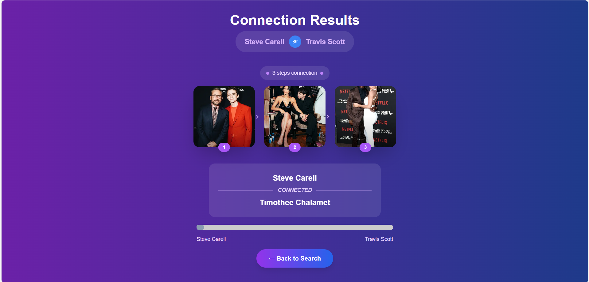

# FindConnections

A [Next.js](https://nextjs.org) app that lets anyone discover connections between
notable individuals by finding instances where they appear together in a photo —
either directly or through a short chain of mutual photos. Inspired by
[six degrees of separation](https://en.wikipedia.org/wiki/Six_degrees_of_separation).

Example: Steve Carell was photographed with Timothée Chalamet, Timothée Chalamet
with Kylie Jenner, and Kylie Jenner with Travis Scott. Four people from
different worlds, three photo hops apart.



## Usage

- **Anyone** can visit the homepage, type two people's names, and click
  **Find Connections** to see the shortest photo-chain between them.
- **Admins** maintain the underlying graph — adding photos manually through
  the admin upload UI, or driving the automated pair-ingestion pipeline
  described below. There is no user/membership concept; the public site is
  read-only.

## Website

[findconnections.net](https://findconnections.net)

## Architecture

| Layer | Stack |
|---|---|
| Frontend + API routes | Next.js (App Router) on Vercel |
| Graph (people + `PHOTOGRAPHED_WITH` edges) | Neo4j on an EC2 instance |
| Image storage | Supabase Storage (`connection-images` bucket, public read) |
| Admin auth (bcrypt + custom JWT) | Supabase Postgres (`public.admins` table) |
| Celebrity face recognition | AWS Rekognition `RecognizeCelebrities` |
| Image search source | Serper (Google results as JSON) |

Connection edges in Neo4j store the absolute Supabase Storage URL of the
photo. The bucket is public, so reads need no presigning.

## Automated celebrity-pair ingestion

Admins can fire-and-forget a pair name into `POST /api/admin/ingest-pair` and
the pipeline does the rest:

1. Search Serper for image results matching `"<personA>" "<personB>"`.
2. Download each candidate, validate MIME / magic-number / size.
3. Run AWS Rekognition `RecognizeCelebrities` on the bytes.
4. Accept the first image where both expected names are detected with
   ≥95% match confidence.
5. Upload to Supabase Storage and create the `PHOTOGRAPHED_WITH` edge in
   Neo4j.

Source files: [lib/integrations/serper.ts](lib/integrations/serper.ts),
[lib/integrations/rekognition.ts](lib/integrations/rekognition.ts),
[lib/services/ingestionService.ts](lib/services/ingestionService.ts),
[app/api/admin/ingest-pair/route.ts](app/api/admin/ingest-pair/route.ts).

## Development

### 1. Clone + install

```sh
git clone https://github.com/Soroush98/FindConnections.git
cd FindConnections
npm install
```

### 2. Configure `.env`

```env
# AWS — only used for Rekognition celebrity detection
AWS_ACCESS_KEY_ID=...
AWS_SECRET_ACCESS_KEY=...
AWS_REGION=us-east-2

# JWT secret for admin session cookies
SECRET_KEY=<at-least-32-chars>

# Neo4j
NEO4J_URI=bolt+ssc://neo4j.findconnections.net:7687
NEO4J_USER=...
NEO4J_PASSWORD=...

# Supabase (admin auth + image storage)
SUPABASE_URL=https://<project>.supabase.co
SUPABASE_ANON_KEY=...
SUPABASE_SERVICE_ROLE_KEY=...      # server-only

# Serper API for automated image search
SERPER_API_KEY=...

# Admin URL obfuscation slug (rewrites /<slug> -> /admin)
ADMIN_SLUG=<random-string>

# Analytics
NEXT_PUBLIC_GA_ID=...
```

### 3. Create the first admin

```sh
npm run seed:admin -- you@example.com 'YourStrongPassword!'
```

### 4. Run

```sh
npm run dev
```

Open [http://localhost:3000](http://localhost:3000). The admin login page is
at `http://localhost:3000/<ADMIN_SLUG>`.

## Security notes

- **Admin URL obfuscation**: `/admin` and `/api/admin/admin-login` return 404
  unless reached through the secret slug rewrite. See
  [next.config.ts](next.config.ts) and [middleware.ts](middleware.ts).
- **Admin passwords**: bcrypt-hashed, stored only in Supabase.
- **JWT for admin sessions**: HS256, signed with `SECRET_KEY`, set as an
  `HttpOnly`, `SameSite=strict` cookie.
- **Service-role Supabase key** is server-only; never imported from a client
  component.

## Contributing

Reach out at soroosh.esmaeilian@gmail.com.
