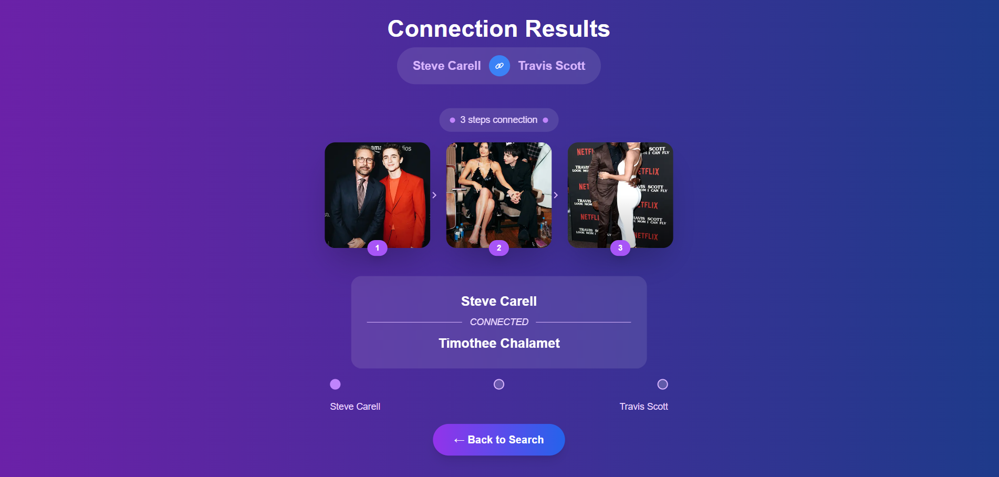

# FindConnections

This is a [Next.js](https://nextjs.org) project bootstrapped with [`create-next-app`](https://nextjs.org/docs/app/api-reference/cli/create-next-app).

## Project Idea
FindConnections enables users to discover connections between notable individuals by identifying instances where they have been photographed together, either directly or through a short chain of others who share photos. This feature offers a unique perspective on the interconnectedness of public figures. Our platform is inspired by the concept of [six degrees of separation](https://en.wikipedia.org/wiki/Six_degrees_of_separation).

Here is how the famous comedy actor Steve Carell is connected to Travis Scott, a rapper. Steve Carell appeared in a picture with Timothée Chalamet. Timothée Chalamet appeared in a picture with Kylie Jenner, and finally, Kylie Jenner has a picture with Travis Scott. It's funny to see how people from different worlds can be connected with just a few connections!



### User Actions
1. **Unregistered Users**:
    - Anyone can enter two people's full names on the first page and click "Find Connections" to see their corresponding connection.

2. **Registered Users**:
    - **User Registration**: Users register on the platform by providing their basic information.
    - **User Profile**: After logging in, users can access their profile page where they can view and update their personal information.
    - **Photo Uploads**: Users can upload up to 10 pictures daily according to the upload guidelines. Each upload request will be reviewed by an admin, and if approved, new connections will be added to the website.

## Website

Visit our website at [findconnections.net](https://findconnections.net).

## Deployment

Deploy the FindConnections platform by following these steps:

1. **Clone the repository**:
    ```sh
    git clone https://github.com/Soroush98/FindConnections.git
    cd FindConnections
    ```

2. **Install dependencies**:
    ```sh
    npm install
    ```

3. **Run the application**:

    Run the development server:

    ```bash
    npm run dev
    # or
    yarn dev
    # or
    pnpm dev
    # or
    bun dev
    ```

    Open [http://localhost:3000](http://localhost:3000) with your browser to see the result.

    You can start editing the page by modifying `app/page.tsx`. The page auto-updates as you edit the file.

5. **Access the application**:
    Open your web browser and navigate to `http://localhost:3000`.

    * Note that only people who have access to the `/api` folder and environment variables can use and test the backend. 

## Architecture


The website (frontend and backend) is deployed on the Vercel platform. Vercel connects with a DynamoDB database for user and admin information and authentication. Vercel retrieves connections between two selected individuals from an EC2 instance running a Neo4j database. Each connection includes an image URL stored in this database. Based on this URL, Vercel fetches the images from an Amazon S3 instance to display to the user.

## Security Features

FindConnections implements several security features to ensure the safety and privacy of its users:

1. **Authentication and Authorization**:
    - Role-based access control to restrict access to certain features based on user roles.
    - When using the API, the authorization header should include the JWT (JSON Web Token)
      provided by the server. This ensures that only users with the appropriate roles can access specific APIs.
    - The JWT is stored as an HTTP-only cookie to prevent client-side access and reduce the risk of XSS attacks.
2. **Data Encryption**:
    - All sensitive data, such as passwords, are encrypted using industry-standard algorithms before being stored in the database.
    - Passwords are hashed using bcrypt to ensure they are stored securely.

3. **Input Validation**:
    - Comprehensive input validation to prevent common security vulnerabilities such as SQL injection and cross-site scripting (XSS).

4. **Secure Communication**:
    - All communication between the client and server is encrypted using HTTPS to protect data in transit.

5. **Secret Key Management**:
    - A secret key is used for signing JWT tokens and other cryptographic operations. This is kept secure and not hard-coded in the source code. 

6. **Admin Page Security**:
    - The real admin page URL is not published in the source code to prevent unauthorized access. A fake admin page is used as a decoy to further enhance security.

7. **IP Lockouts**:
    - If an IP address attempts multiple failed logins within a short timeframe, it will be temporarily banned to prevent brute-force attacks.

## Development

If you want to contribute to the project frontend or backend, please contact me at soroosh.esmaeilian@gmail.com.
